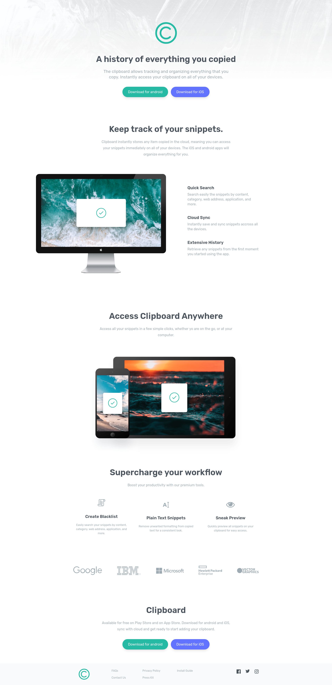

# Clipboard App Showcase Website
Clipboard landing page from the Udemy Course: TailwindCSS from Scratch and from Frontend Mentor Challenge.

It is a design for a clipboard app showcase that is frequently used by mobile applications. This project uses Tailwind CLI.

## Made using:


## Usage
Install Dependencies:
```
npm install
```
Run Tailwind CLI
```
npm run watch
```

## Screenshot

